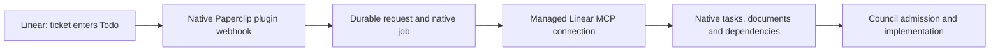

# Paperclip Linear Intake

A separate Paperclip plugin that will turn an authorized Linear transition to
**Todo** into a durable import of the ticket and its sub-issues, then hand the
prepared work to a governed implementation workflow such as Council.

**Current state:** Lot 1 partial: executable package/manifest/worker, disabled
intake and explicit gateway catalog inspection, checked against published SDK
`2026.1005.0`. Native Linear access and the complete source reader remain blocked.
No installation, webhook, credentials, real-ticket processing or Council admission
has been performed. Lots 2 and 3 have not started. See the
[criterion-by-criterion qualification](docs/qualification/LOT1.md).

## Local verification

Requires Node 24.20.0 and npm 11.19.0 (CI pins both).

```bash
npm ci --ignore-scripts --no-audit --no-fund
npm run check
npm pack --dry-run --json
```

`npm run check` typechecks, builds and runs the SDK harness and actual worker
RPC tests with synthetic host services. Dependencies come from the public npm
registry and the committed lockfile; no adjacent checkout is needed.

Default configuration is `{ "enabled": false, "gatewayDiscoveryEnabled": false }`.
This version rejects `enabled: true`. An explicitly enabled `inspect-gateway`
action can inspect a configured named gateway catalog using a native secret
reference; it cannot call Linear tools, import issues or wake agents. Startup,
health and config validation perform no HTTP or secret reads.

## Intended flow (not yet implemented)



The integration owns event verification, complete source retrieval, import
identity, recovery, and the handoff. Council owns the project mandate, budget,
execution order, review, and acceptance.

## First scope

- One explicitly configured Linear workspace/team/project and its exact Todo
  workflow-state ID, mapped to one Paperclip company/project.
- A parent entering Todo selects its remaining descendant work; a child entering
  Todo selects its own subtree and does not authorize its siblings.
- Reuse Paperclip's managed Linear MCP connection, plugin webhooks, jobs,
  secrets, storage, tasks, documents, relations, and events where their contracts
  cover the required behavior.
- Use the official GraphQL API only for source reads that the verified managed
  connector cannot provide.
- Preserve Linear identity, descriptions, hierarchy, blockers, and historical
  results. Duplicate deliveries and restarts must not create a second launch.
- Import and admission run without a model call. Any planning needed from the
  implementation lead belongs to the workflow's existing authorized budget.

Milestone campaigns, Slack, Linear status writeback, merge, deployment, and
Paperclip core changes are outside this first scope.

## Documents

- [Architecture and ownership](docs/ARCHITECTURE.md)
- [Todo import and handoff contract](docs/TODO-INTAKE-CONTRACT.md)
- [Implementation sequence and acceptance checks](docs/IMPLEMENTATION-PLAN.md)
- [Repository working instructions](AGENTS.md)

The Council integration is a separate dependency. Its current source requires
manual-origin roots; adding a connector does not by itself make imported tasks
admissible. The hierarchy implementation also requires contributor assignments
and explicit write scopes for executable leaves. Both gaps are recorded in the
contract and must be qualified before enabling automatic launch.
